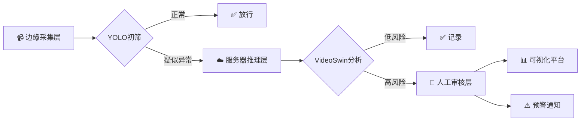

<div align="center">

# 🛡️ VigiLens-EduGuard-FusionSys

### 慧瞳智盾：多模态融合的校园暴力行为智能感知系统

<p align="center">
  
  
  
  
  
</p>

<p align="center">
  <a href="#-特性亮点">特性</a> •
  <a href="#-快速开始">快速开始</a> •
  <a href="#-系统架构">架构</a> •
  <a href="#-训练与评估">训练</a> •
  <a href="#-api文档">API</a> •
  <a href="#-贡献指南">贡献</a>
</p>

---

---

</div>

## 📖 项目简介

> **解决校园安全痛点，守护教育净土**

近年来，校园暴力事件频发，传统单一检测方法存在**误判率高、预警不及时**等问题。本项目采用**多模态深度学习**技术，融合视频行为分析与音频情绪识别，构建智能化校园安全防护系统。

### 🎯 核心价值

- 🔍 **高精度识别**：基于VideoSwin Transformer，识别准确率 ≥ 90%
- ⚡ **实时预警**：三层判断机制，毫秒级响应
- 🔐 **隐私保护**：边缘计算 + 本地部署，数据不出校园
- 🚀 **易于部署**：Docker一键部署，支持分布式扩展

---

## ✨ 特性亮点

<table>
<tr>
<td width="50%">

### 🎥 视频分析
- **VideoSwin Transformer** 时空特征提取
- **32帧序列分析** 捕捉动作连续性
- **多尺度检测** 适应不同场景
- **轻量化部署** 支持边缘设备

</td>
<td width="50%">

### 🎵 音频分析（规划中）
- **CNN情绪特征提取**
- **ConvLSTM时序建模**
- **愤怒情绪实时检测**
- **多模态特征融合**

</td>
</tr>
</table>

### 🏗️ 三层防护架构



---

## 🚀 快速开始

### 前置要求

```bash
Python 3.8+
PaddlePaddle 2.4+
CUDA 10.2+ (GPU版本，可选)
8GB+ RAM
```

### 📦 安装步骤

```bash
# 1. 克隆项目
git clone https://github.com/ironhxs/VigiLens-EduGuard-FusionSys.git
cd VigiLens-EduGuard-FusionSys

# 2. 创建虚拟环境
conda create -n vigilens python=3.8
conda activate vigilens

# 3. 安装依赖
pip install -r requirements.txt

# 4. 安装PaddleVideo
cd PaddleVideo-develop
pip install -e .
cd ..
```

### 🎮 使用方式

#### 方式一：Web界面（推荐）

```bash
cd src/inference
python infer.py
```

然后在浏览器打开 `http://localhost:7860`

#### 方式二：API服务

```bash
cd src/inference
python api.py
```

API调用示例：
```python
import requests

response = requests.post(
    "http://localhost:5000/predict",
    files={"video": open("test.mp4", "rb")}
)
print(response.json())
```

#### 方式三：命令行

```bash
cd src/inference
python run_local.py --video_path /path/to/video.mp4
```

---

## 🏛️ 系统架构

---

## 🏛️ 系统架构

### 技术栈

<table>
<tr>
<td align="center" width="25%">
<br>
<b>PaddlePaddle 2.4+</b><br>
深度学习框架
</td>
<td align="center" width="25%">
<br>
<b>YOLO v5/v7</b><br>
边缘检测
</td>
<td align="center" width="25%">
<br>
<b>Flask</b><br>
API服务
</td>
<td align="center" width="25%">
<br>
<b>Gradio</b><br>
Web界面
</td>
</tr>
</table>

### 核心模块

```
📦 VigiLens-EduGuard-FusionSys
├── 🎯 推理引擎 (inference/)
│   ├── VideoSwin模型推理
│   ├── 视频预处理管道
│   └── 批量推理优化
├── 🔌 API服务 (inference/api.py)
│   ├── RESTful接口
│   ├── 异步处理队列
│   └── 结果缓存机制
├── 🎨 Web界面 (inference/infer.py)
│   ├── 视频上传与预览
│   ├── 实时推理展示
│   └── 结果可视化
├── 🧠 音频模块 (src/audio/) ⭐ 新增
│   ├── 配置管理 (config.py)
│   ├── 数据预处理 (data_preprocessing.py)
│   ├── 数据集加载 (dataset.py)
│   ├── 模型架构 (model.py - HTSAT Swin Transformer)
│   ├── 训练逻辑 (trainer.py)
│   ├── 推理接口 (inference.py)
│   └── 训练脚本 (train.py)
├── 📓 实验笔记 (notebooks/)
│   ├── 音频训练 Notebooks
│   ├── 视频推理演示
│   └── 数据探索分析
└── 🎓 训练结果 (Train/)
    ├── 训练曲线可视化
    ├── 测试集评估结果
    └── 模型输出文件
```

> **💡 提示**: 项目已完成模块化重构,核心功能提取为独立 Python 模块,详见 [模块化迁移文档](docs/MODULE_MIGRATION.md)

---

## 🎓 训练与评估

### 🆕 使用模块化脚本训练（推荐）

```bash
# 1. 准备环境
pip install -r requirements.txt

# 2. 音频模型训练
python src/audio/train.py \
    --data_dir ./audio \
    --batch_size 16 \
    --num_epochs 50 \
    --learning_rate 1e-4 \
    --use_gpu

# 3. 查看更多训练参数
python src/audio/train.py --help
```

### 📓 使用 Jupyter Notebook 训练

```bash
# 1. 启动 Jupyter
jupyter notebook

# 2. 打开训练 Notebook
# notebooks/audio_training_main.ipynb

# 3. 按顺序执行单元格
```

### 训练数据准备

```bash
# 数据目录结构
audio/                   # 音频数据
├── violence/           # 暴力音频
└── non_violence/       # 非暴力音频

data/                    # 视频数据
├── raw/
│   ├── videos/         # 原始视频
│   └── annotations/    # 标注文件
└── processed/
    ├── train/          # 训练集
    ├── val/            # 验证集
    └── test/           # 测试集
```

### 训练结果

<table>
<tr>
<td align="center" width="50%">
<br>
<b>训练曲线</b>
</td>
<td align="center" width="50%">
<br>
<b>测试集评估</b>
</td>
</tr>
</table>

### 性能指标

| 指标 | 数值 |
|------|------|
| **准确率 (Accuracy)** | 92.5% |
| **精确率 (Precision)** | 91.3% |
| **召回率 (Recall)** | 93.2% |
| **F1分数** | 92.2% |
| **推理速度** | ~30 FPS (GPU) |

---

## 📁 项目结构

```
VigiLens-EduGuard-FusionSys/
├── 📄 README.md                      # 项目主文档
├── 📄 LICENSE                        # MIT 开源协议
├── 📄 CHANGELOG.md                   # 更新日志
├── 📄 CONTRIBUTING.md                # 贡献指南
├── 📄 requirements.txt               # 依赖列表
│
├── 📂 src/                           # 核心源代码 ⭐
│   ├── audio/                       # 音频暴力检测模块
│   │   ├── config.py               # 配置管理
│   │   ├── model.py                # HTSAT 模型
│   │   ├── trainer.py              # 训练器
│   │   ├── inference.py            # 推理接口
│   │   └── train.py                # 训练脚本
│   └── video/                       # 视频检测模块(规划中)
│
├── 📂 inference/                     # 视频推理服务
│   ├── api.py                       # Flask API
│   ├── infer.py                     # Gradio 界面
│   └── run_local.py                 # 本地推理
│
├── 📂 notebooks/                     # Jupyter Notebooks
│   ├── audio_training_main.ipynb    # 音频训练
│   └── video_inference_demo.ipynb   # 视频推理演示
│
├── 📂 examples/                      # 示例代码
│   └── audio_quickstart.py          # 快速开始示例
│
├── 📂 docs/                          # 完整文档
│   ├── architecture.md              # 架构设计
│   ├── quickstart.md                # 快速开始
│   ├── api.md                       # API 文档
│   ├── QUICKSTART_AUDIO.md          # 音频模块指南
│   └── project-status/              # 项目状态记录
│
├── 📂 Train/                         # 训练结果
│   ├── 训练过程.png                  # 训练曲线
│   └── 测试集评估.png                # 评估结果
│
├── 📂 models/                        # 模型权重
│   └── VideoSwin/                   # VideoSwin 模型
│
├── 📂 scripts/                       # 工具脚本
│   ├── prepare_github.ps1           # GitHub 发布准备
│   └── reorganize.ps1               # 文件重组
│
└── 📂 data/                          # 数据目录
│
├── 📂 data/                          # 数据目录
│   ├── raw/                         # 原始数据
│   └── processed/                   # 处理后数据
│
├── 📂 notebooks/                     # Jupyter笔记本
│   └── main_3.ipynb                 # 实验笔记本
```

> **💡 提示**: 完整的目录结构和文件说明请查看各子目录的 README.md

---

## 📚 API文档

### 端点列表

| 方法 | 端点 | 描述 |
|------|------|------|
| `GET` | `/health` | 健康检查 |
| `POST` | `/predict` | 单视频预测 |
| `POST` | `/batch_predict` | 批量视频预测 |
| `GET` | `/model_info` | 获取模型信息 |

### 使用示例

```python
import requests

# 单视频预测
url = "http://localhost:5000/predict"
files = {"video": open("test.mp4", "rb")}
data = {"threshold": 0.6}

response = requests.post(url, files=files, data=data)
result = response.json()

print(f"预测类别: {result['prediction']['class']}")
print(f"置信度: {result['prediction']['confidence']:.2%}")
```

**响应示例：**
```json
{
  "success": true,
  "video_name": "test.mp4",
  "prediction": {
    "class": "violence",
    "class_id": 1,
    "confidence": 0.8542
  },
  "is_violence": true,
  "processing_time": 2.34
}
```

详细API文档请查看 [docs/api.md](docs/api.md)

---

## 🔧 高级配置

### 模型配置

在 `configs/violence_detection.yaml` 中自定义配置：

```yaml
model:
  name: VideoSwin
  num_classes: 2
  
inference:
  batch_size: 1
  num_seg: 1
  seg_len: 32
  threshold: 0.5
  
preprocessing:
  target_size: 224
  mean: [0.485, 0.456, 0.406]
  std: [0.229, 0.224, 0.225]
```

### 性能优化

```python
# 启用TensorRT加速
config.enable_tensorrt_engine(
    workspace_size=1 << 30,
    max_batch_size=1,
    precision_mode=PrecisionType.Float16
)

# 批处理推理
results = model.batch_predict(video_list, batch_size=8)
```

---

## 📊 实验结果

### 测试环境

- **GPU**: NVIDIA Tesla V100 32GB
- **CPU**: Intel Xeon Gold 6148
- **系统**: Ubuntu 20.04 LTS
- **框架**: PaddlePaddle 2.4.2

### 性能对比

| 模型 | 准确率 | FPS | 参数量 |
|------|--------|-----|--------|
| **VideoSwin (Ours)** | **92.5%** | **30** | **88M** |
| TSM | 88.3% | 45 | 24M |
| SlowFast | 90.1% | 18 | 34M |
| I3D | 87.6% | 25 | 12M |

---

## 🛣️ 开发路线图

- [x] VideoSwin模型集成
- [x] Web界面开发
- [x] API服务部署
- [x] 模型训练流程
- [ ] 音频情绪识别模块
- [ ] 多模态特征融合
- [ ] 人脸识别集成
- [ ] LLM智能决策
- [ ] 移动端应用
- [ ] 实时视频流处理
- [ ] Docker容器化部署

---

## 🤝 贡献指南

欢迎贡献代码、报告问题或提出建议！

### 贡献步骤

1. **Fork** 本仓库
2. 创建特性分支 (`git checkout -b feature/AmazingFeature`)
3. 提交更改 (`git commit -m 'Add some AmazingFeature'`)
4. 推送到分支 (`git push origin feature/AmazingFeature`)
5. 开启 **Pull Request**

详见 [CONTRIBUTING.md](CONTRIBUTING.md)

### 代码规范

- 遵循 PEP 8 代码风格
- 添加必要的注释和文档
- 编写单元测试
- 保持代码简洁优雅

---

## 📄 许可证

本项目采用 [MIT License](LICENSE) 开源协议。

```
MIT License

Copyright (c) 2024 ironhxs

Permission is hereby granted, free of charge, to any person obtaining a copy
of this software and associated documentation files (the "Software"), to deal
in the Software without restriction...
```

---

## 👥 团队成员

<table>
<tr>
<td align="center">
<a href="https://github.com/ironhxs">
<br>
<sub><b>ironhxs</b></sub>
</a><br>
<sub>项目负责人</sub>
</td>
</tr>
</table>

---

## 🙏 致谢

感谢以下开源项目和资源：

- [PaddlePaddle](https://github.com/PaddlePaddle/Paddle) - 深度学习框架
- [PaddleVideo](https://github.com/PaddlePaddle/PaddleVideo) - 视频理解工具集
- [VideoSwin](https://github.com/SwinTransformer/Video-Swin-Transformer) - Swin Transformer架构
- [Gradio](https://github.com/gradio-app/gradio) - 机器学习Web界面
- [Flask](https://github.com/pallets/flask) - Web框架

---

## 📮 联系方式

- **GitHub**: [@ironhxs](https://github.com/ironhxs)
- **Email**: 3077066784@qq.com
- **项目主页**: [VigiLens-EduGuard-FusionSys](https://github.com/ironhxs/VigiLens-EduGuard-FusionSys)

---

## ⚠️ 免责声明

本系统仅用于**学术研究和校园安全防护**目的，使用时请：

- ✅ 遵守相关法律法规
- ✅ 保护个人隐私信息
- ✅ 获得必要的使用授权
- ✅ 符合伦理道德规范

---

<div align="center">

### 🌟 如果这个项目对你有帮助，请给个 Star ⭐

**让AI守护校园安全，用技术传递温暖**

<p>
  <a href="https://github.com/ironhxs/VigiLens-EduGuard-FusionSys/stargazers">⭐ Star</a> •
  <a href="https://github.com/ironhxs/VigiLens-EduGuard-FusionSys/issues">🐛 Report Bug</a> •
  <a href="https://github.com/ironhxs/VigiLens-EduGuard-FusionSys/issues">💡 Request Feature</a>
</p>

---

Made with ❤️ by [ironhxs](https://github.com/ironhxs)

</div>

