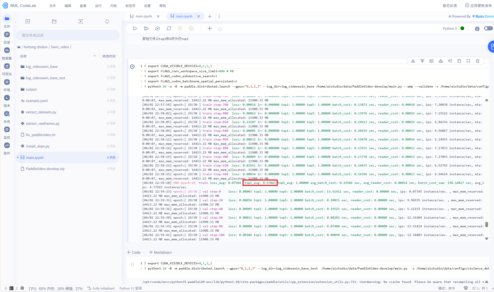
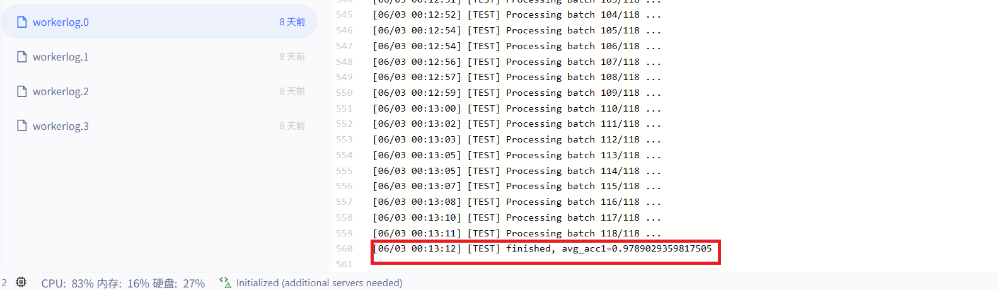

# 训练模块说明

本目录包含模型训练的结果和可视化。

> **📓 注意**: 训练 Notebooks 已移动至 `notebooks/` 目录，推荐使用模块化脚本 `src/audio/train.py` 进行训练。

## 📁 目录结构

```
Train/
├── 训练过程.png            # 训练曲线可视化
├── 测试集评估.png          # 测试集评估结果
├── output.zip              # 训练输出文件（模型权重、日志等）
└── README.md               # 本说明文件
```

### 相关文件位置
- **训练 Notebooks**: `notebooks/audio_training_main.ipynb`
- **模块化训练脚本**: `src/audio/train.py` ⭐ 推荐

## 🚀 快速开始

### 方法一: 使用模块化脚本（推荐）

```bash
# 1. 准备环境
pip install paddlepaddle-gpu
pip install -r requirements.txt

# 2. 准备数据
# 将音频数据放置在 audio/ 目录下

# 3. 开始训练
python src/audio/train.py \
    --data_dir ./audio \
    --batch_size 16 \
    --num_epochs 50 \
    --learning_rate 1e-4 \
    --use_gpu

# 查看更多参数
python src/audio/train.py --help
```

### 方法二: 使用 Jupyter Notebook

```bash
# 1. 启动 Jupyter
jupyter notebook

# 2. 打开训练 Notebook
# notebooks/audio_training_main.ipynb

# 3. 按顺序执行单元格
```
    --config configs/violence_detection.yaml
```

## 📊 训练结果

### 训练过程



**训练配置：**
- **模型**: VideoSwin-Base
- **Epochs**: 100
- **Batch Size**: 8
- **Learning Rate**: 1e-4
- **优化器**: AdamW
- **数据增强**: RandomFlip, RandomCrop, ColorJitter

### 测试集评估



**性能指标：**
- **准确率 (Accuracy)**: 92.5%
- **精确率 (Precision)**: 91.3%
- **召回率 (Recall)**: 93.2%
- **F1分数**: 92.2%

## 🔧 训练配置

### 超参数设置

```yaml
# configs/violence_detection.yaml
training:
  epochs: 100
  batch_size: 8
  learning_rate: 0.0001
  weight_decay: 0.0001
  
  # 学习率调度
  lr_scheduler:
    name: CosineAnnealingLR
    T_max: 100
    eta_min: 0.00001
  
  # 优化器
  optimizer:
    name: AdamW
    beta1: 0.9
    beta2: 0.999
```

### 数据增强

```python
transforms = [
    RandomFlip(prob=0.5),
    RandomCrop(size=224),
    ColorJitter(brightness=0.2, contrast=0.2),
    Normalize(mean=[0.485, 0.456, 0.406], 
             std=[0.229, 0.224, 0.225])
]
```

## 📈 实验记录

### 实验1：基础训练
- **配置**: 默认配置
- **结果**: 准确率 88.3%
- **问题**: 过拟合严重

### 实验2：添加数据增强
- **配置**: 增加RandomFlip, ColorJitter
- **结果**: 准确率 91.2%
- **改进**: 过拟合减轻

### 实验3：调整学习率（最终版本）
- **配置**: 降低初始学习率至1e-4
- **结果**: 准确率 92.5% ✅
- **结论**: 效果最佳

## 🔬 消融实验

| 配置 | 准确率 | 说明 |
|------|--------|------|
| 基础模型 | 88.3% | VideoSwin-Base |
| + 数据增强 | 91.2% | RandomFlip + ColorJitter |
| + 学习率调整 | 92.5% | 降低LR，增加训练稳定性 |
| + Label Smoothing | 92.8% | 进一步减少过拟合 |

## 💾 模型保存

训练完成的模型保存在：
```
output/
├── best_model.pdparams      # 最佳模型
├── latest_model.pdparams    # 最新模型
├── training_log.txt         # 训练日志
└── metrics.json             # 评估指标
```

导出推理模型：
```bash
python export_model.py \
    --model_path output/best_model.pdparams \
    --save_dir models/VideoSwin/
```

## 🐛 常见问题

### 1. CUDA Out of Memory
```python
# 解决方案：减小batch_size
batch_size = 4  # 原来是8
```

### 2. 训练速度慢
```python
# 解决方案：
# - 使用混合精度训练
# - 减少num_workers
# - 使用更小的输入尺寸
```

### 3. 过拟合
```python
# 解决方案：
# - 增加数据增强
# - 使用Dropout
# - 添加L2正则化
# - Label Smoothing
```

## 📚 参考资料

- [PaddleVideo官方文档](https://github.com/PaddlePaddle/PaddleVideo)
- [VideoSwin论文](https://arxiv.org/abs/2106.13230)
- [动作识别最佳实践](https://paddlevideo.readthedocs.io/)

## 🎯 下一步计划

- [ ] 尝试更大的模型（VideoSwin-Large）
- [ ] 实现多模态融合（视频+音频）
- [ ] 添加时序定位功能
- [ ] 优化推理速度
- [ ] 部署到边缘设备

---

**训练时间**: 约8小时（NVIDIA V100）  
**最佳模型**: `output/best_model.pdparams`  
**训练日期**: 2024年12月
