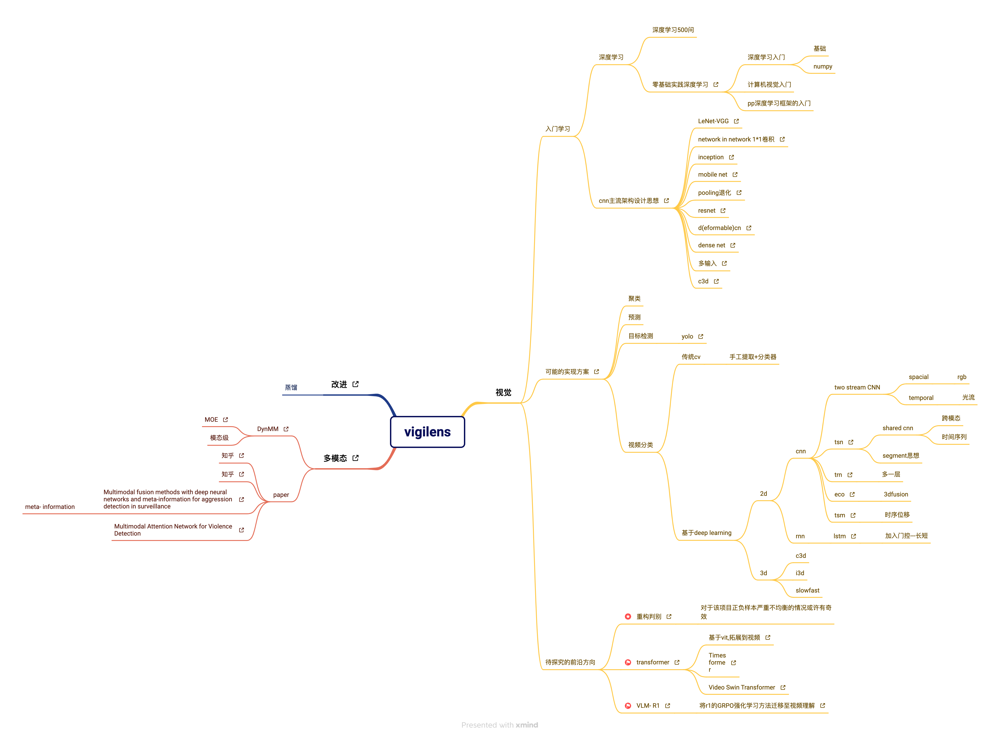

# 工作进展小结(视频、多模态)
贺鑫帅
1. 综述
    - 先是借助国产深度学习框架平台paddlepaddle的在线学习文档[《零基础实践学习深度学习》](https://www.paddlepaddle.org.cn/tutorials/projectdetail/5604804)进行了深度学习相关基础、cv的基本入门以及飞桨框架的基本学习.
    - 后来又选择性阅读了Github上爆火的书籍《深度学习500问》,进一步恶补基础.
    - 接着为了了解目前该项目cv相关的情况,通过知乎以及google scholar 阅读了相关解读文章和论文.
        1. cnn相关架构的发展
        2. 针对该项目的cv相关的实现方案进行了总结.
        3. 对深度多模态学习相关知识进行了了解

2. 视频模态
    - 阅读的论文如下
        >- [Research on Video Abnormal Behavior Detection Based on Deep Learning](https://www.opticsjournal.net/Articles/Abstract?aid=OJd480181b112c1c33)
        >- [Campus violence action recognition based on lightweight graph convolution network](http://cjlcd.lightpublishing.cn/thesisDetails#10.37188/CJLCD.2021-0229)
        >- [Not only Look, But Also Listen: Learning Multimodal Violence Detection Under Weak Supervision](https://link.springer.com/content/pdf/10.1007/978-3-030-58577-8_20.pdf)
        >- [Violence Detection in Videos Based on Fusing Visual and Audio Information](https://ieeexplore.ieee.org/document/9413686/)
        >- [Spatio-Temporal AutoEncoder for Video Anomaly Detection](https://dl.acm.org/doi/10.1145/3123266.3123451)
    - 阅读的论文解读文章如下
        >- [基于YOLOv8的暴力行为检测系统](https://www.cnblogs.com/sixuwuxian/p/18063057?utm_source=chatgpt.com)
        >- [技术论文|基于人体关节点多特征融合的暴力行为识别](https://mp.weixin.qq.com/s?__biz=MzA3NDIyMTQzMA==&mid=2651719908&idx=1&sn=ed196db58203a1f9208291c5f4bd1e6f&chksm=855c9ad2f9b6b22ccd7f9b2511905d6ab15406cfe9ac4e5ccad7ec03fdd487d8a0481acb7598&mpshare=1&scene=1&srcid=0227qbXICEKBR6xk5yKM0EWN&sharer_shareinfo=7d0e8eadc3715347ad38731795209435&sharer_shareinfo_first=7d0e8eadc3715347ad38731795209435)
        >- [浅谈动作识别TSN, TRN, ECO](https://zhuanlan.zhihu.com/p/45154107?utm_medium=social&utm_psn=1879349219124549057&utm_source=ZHShareTargetIDMore)
        >- [【论文分享】TSM: 实现高效率视频理解的时序移动方法](https://zhuanlan.zhihu.com/p/335609833?utm_medium=social&utm_psn=1879336787777921182&utm_source=ZHShareTargetIDMore)
        >- [时空建模新文解读：用于高效视频理解的TSM](https://zhuanlan.zhihu.com/p/50798936?utm_medium=social&utm_psn=1879336396659066553&utm_source=ZHShareTargetIDMore)
        >- [【论文分享】TSM: 实现高效率视频理解的时序移动方法](https://zhuanlan.zhihu.com/p/335609833?utm_medium=social&utm_psn=1879336787777921182&utm_source=ZHShareTargetIDMore)
        >- [更快更强！视频理解模型PP-TSM重磅发布：速度比SlowFast快4.5倍](https://zhuanlan.zhihu.com/p/380815278?utm_medium=social&utm_psn=1879336679539722160&utm_source=ZHShareTargetIDMore)
        >- [人人都能看懂的LSTM](https://zhuanlan.zhihu.com/p/32085405?utm_medium=social&utm_psn=1879336052944258096&utm_source=ZHShareTargetIDMore)
        >- [从入门到放弃：深度学习中的模型蒸馏技术](https://zhuanlan.zhihu.com/p/93287223?utm_medium=social&utm_psn=1878773234935248594&utm_source=ZHShareTargetIDMore)
        >- [模型压缩-剪枝算法详解](https://zhuanlan.zhihu.com/p/622519997?utm_medium=social&utm_psn=1878777110467949063&utm_source=ZHShareTargetIDMore)
        >- [模型压缩－量化，剪枝，蒸馏，二值化](https://zhuanlan.zhihu.com/p/609557692?utm_medium=social&utm_psn=1878776618304116132&utm_source=ZHShareTargetIDMore)
    - 视频分类    
        - 传统cv
            手工提取+分类器
        - 基于深度学习
            - 2d
                1. 基于cnn
                    - two stream CNN
                        >通过两个2维卷积层分别提取spacial和temporal的特征
                    - tsn  
                        >在two stream CNN的基础上引入稀疏时间采样思想,减少了计算量.
                    - trn
                        >1. 对时间帧进行组合.
                        >2. 融合函数更加复杂而非简单平均池化.
                    - eco
                        >在稀疏时间采样后,使用C3D而非简单2d来提取时空特征
                    - tsm
                        >人为调度temporal channel来近似模拟卷积,从而使2d的计算量达到3d的效果.
                2. 基于rnn
                    - LSTM
                        >引入门控来抽象实现忘记、记忆等作用
        - 结论方案(***PPTSM***)
            - 经过对比TSM具有2维的运算速度,同时有接近3维的性能.而PP上刚好有PPTSM,虽然百度在AI上*起了个大早,赶了个晚集*,但是国产自研框架还是意义非凡,于是还是尝试使用PaddlePaddle这个平台.
            >[更快更强！视频理解模型PP-TSM重磅发布：速度比SlowFast快4.5倍](https://zhuanlan.zhihu.com/p/380815278?utm_medium=social&utm_psn=1879336679539722160&utm_source=ZHShareTargetIDMore)
        - 研究方向
            1. transformer在视频的应用
                - [Timesformer](https://arxiv.org/pdf/2102.05095.pdf)
                - [Video Swin Transformer](https://arxiv.org/pdf/2106.13230.pdf)
                - [【论文分享】视频理解中的时空注意力机制(TimeSformer)](https://zhuanlan.zhihu.com/p/372712811?utm_medium=social&utm_psn=1880299261859709112&utm_source=ZHShareTargetIDMore)
            2. [重构判别](https://dl.acm.org/doi/10.1145/3123266.3123451)
                >校园暴力的样本要远远小于正常样本的数量,重构判别对于该项目正负样本严重不均衡的情况或许有奇效.
            3. [VLM-R1](https://github.com/om-ai-lab/VLM-R1)
                >这个项目参考来自去年 DeepSeek 开源的 R1 模型的GRPO（Group Relative Policy Optimization）强化学习方法(在纯文本大模型上取得了惊人的效果),将其应用到视觉理解上,比较有意思.
            4. 模型压缩
                >出于对算力成本以及暴力检测时效性的考虑,后期想实际落地这个项目的话,可能需要通过模型蒸馏等技术来对比较好的性能的模型进行压缩.

3. 多模态深度学习的方案
    - 阅读论文及文章如下
        >- [Multimodal fusion methods with deep neural networks and meta-information for aggression detection in surveillancemeta- information](https://linkinghub.elsevier.com/retrieve/pii/S0957417422016013)
        >- [Multimodal Attention Network for Violence Detection](https://ieeexplore.ieee.org/document/9712676/)
        >- [多模态深度学习：用深度学习的方式融合各种信息](https://zhuanlan.zhihu.com/p/259529764?utm_medium=social&utm_psn=1880023204204087044&utm_source=ZHShareTargetIDMore)
        >- [解读论文-Dynamic Multimodal Fusion, CVPR, 2023](https://www.zhihu.com/question/68475891/answer/3380697212?utm_medium=social&utm_psn=1880022995449398593&utm_source=ZHShareTargetIDMore)
        >- [混合专家模型 (MoE) 详解](https://zhuanlan.zhihu.com/p/674698482?utm_medium=social&utm_psn=1880182008954721585&utm_source=ZHShareTargetIDMore)
    - 初步想法
        >选取情感、视频、音频、(文本)模态进行分析,形成感性与理性分析结合的架构.
        >   >架构如下
        >   >- 模态数据选择：模态级DynMM（基于MOE）根据当前情况（光照、噪声（如雨声）等）选择合适输入模态数据。
        >   >- 分析部分
        >   >   - "理性分析"：构建端到端的大多模态深度学习网络，直接基于原始的视频、音频、文本数据进行建模，形成理性分析。
        >   >   - "感性分析"：通过传统特征提取进而构建情感分析的深度学习网络，形成感性分析。
        >   >- late fusion：最后通过一个fusion模块，对分析的结果进行融合。

4. 今后方向
    1. 先基于现有已落地的SOTA模型(PP_TSM等)实现比对一下,在4-5月份评定立项等级之前先大体形成一个可用的demo.
    2. 进一步探索和实验前沿论文中提到的可参考移植的模型,来进一步优化我的模型,(如上述研究方向的探究transformer在视频应用、尝试实现基于重构判别的实现方法、考虑优化那些计算量大但性能好的模型,随后用蒸馏等压缩模型望得到更好的解决方案)

                    
                    

