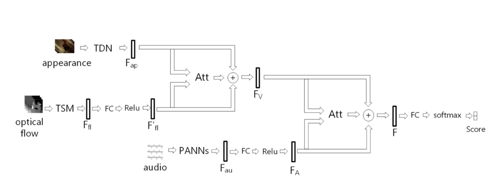
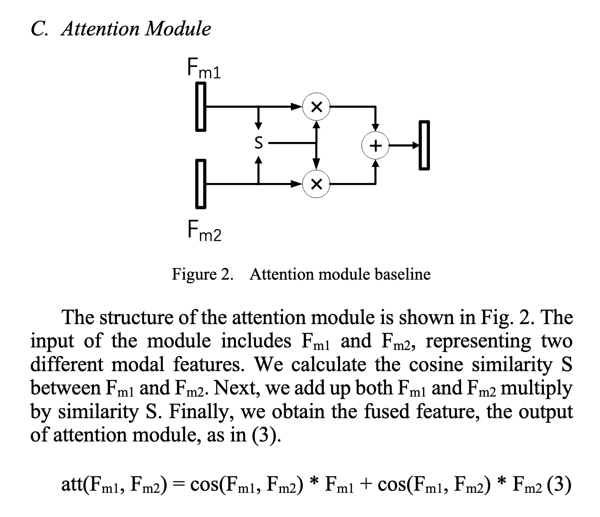
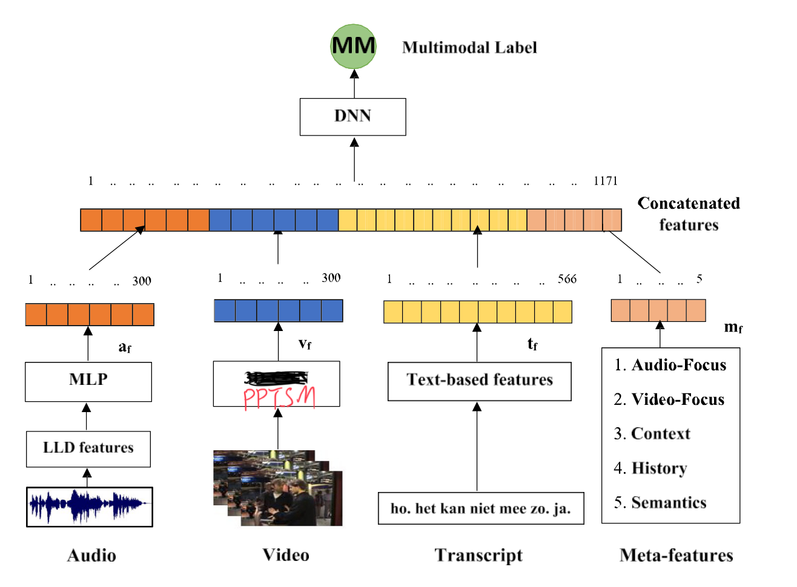
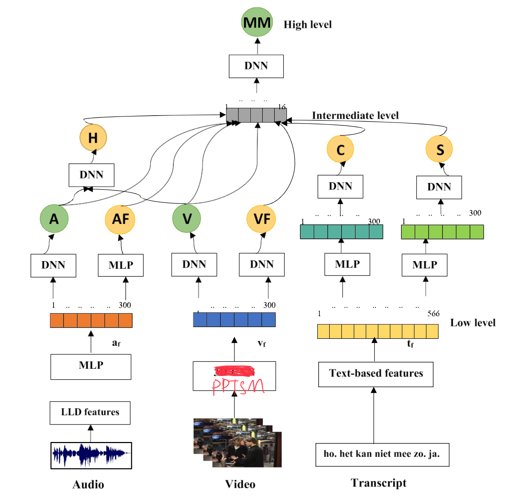
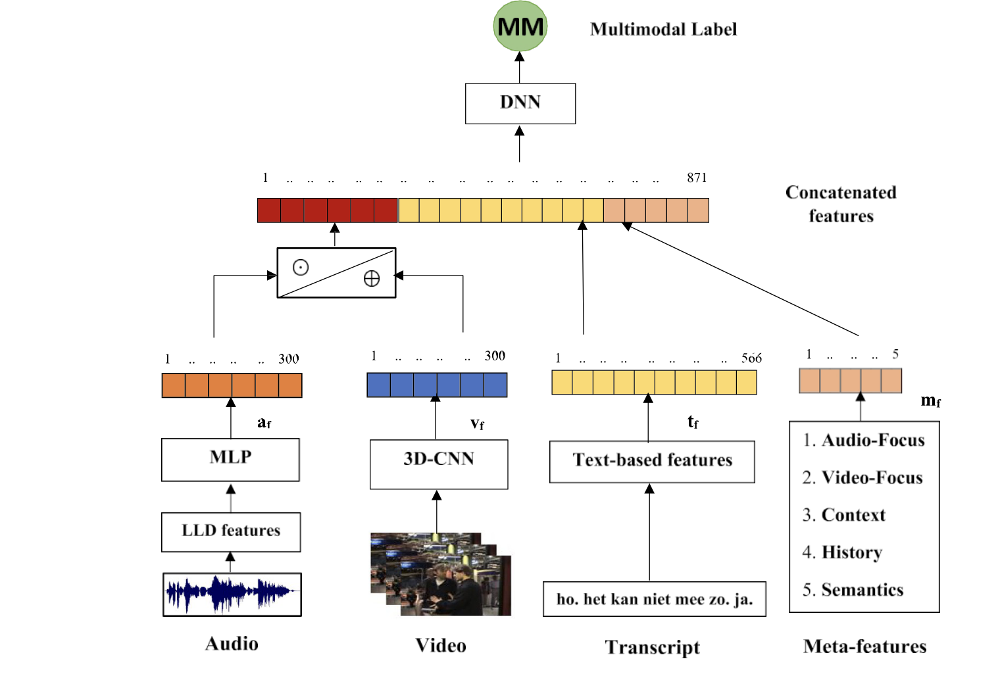
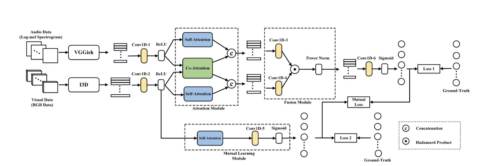
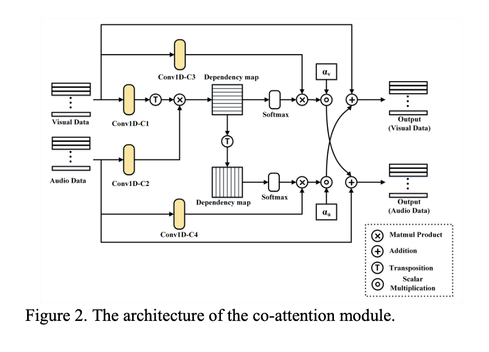

# 第二周汇报(3.18)
贺鑫帅
# 摘要
本周主要研究了论文产出技巧,受此启发,我开始了解视频理解的前沿模块---attention,看了两篇文章,大体对其有了些了解.
同时,我的研究方向从追求效率转为先追求分类质量,后研究蒸馏机制(同时这个也是前沿)来压缩模型.同时,看了下模态融合的文章,对模态融合的前沿方法有了基本了解,打算从模仿开始寻求创新.
# 想法
1. 将经典模型的lstm替换为tsm等模型，期望得到更好的效果，进而创新。
2. 受机器学习课程的启发想到不对称损失函数来解决
    - 样本不平衡
    - 偏重于“宁错检一千正常,不漏检测一个暴力案例”
3. 元特征
    - 本质为高级特征,比较感兴趣.
4. 注意力机制
    - 多模态融合
    - 视频模态处理
5. 原来思想局限在工程上需要时限等因素,现调整方向为从论文产出考虑追求性能。
# 知识及经验总结
1. 多模态紧凑双线性池化
2. 知识蒸馏
    1. PPDML
        1. 自学习
3. 融合方法
    1. 元素运算
    2. concat
    3. 基于注意力机制
4. 水论文技巧
    1. 裁缝精神
# 架构研究
## 第一篇
注意力加入方式
- 
    - 这个是通过注意力融合加元素运算实现的。
    - 除此之外，这个比较有意思的是通过TSM来提取光流信息，用新方法来实现老方法（光流）当然也不失为一个创新点。
- 
    - 此论文用到的注意力融合模块
## 第二篇
元特征+多模态融合方式
1. 基于concat
2. 引入中间层
    - 当然在这个history让我联想到了lstm的记忆门控，可以跨算法融合一下。
3. 元素运算+concat
## 第三篇
这个有点复杂,暂时没研究明白
1. 这个显然更复杂，基本上就是通过元素运算和concat，不过新的点在于这个co- attention
- 该文章提到的注意力模块
# 数据集
在看论文过程中也注意积累了下数据集
1. XD-Violence
2. VSD2015
# 工具
最近看了下[paddlepaddle's github](https://github.com/PaddlePaddle/PaddleVideo/tree/develop?tab=readme-ov-file)发现居然里面有最新的Timestransformer等注意力视频模型,以及模型蒸馏等
1. paddlepaddle video
2. paddlepaddle x
# 下周工作
1. 学会pp的使用,同时用它来复刻VideoSwin和PP-TimeSformer
2. 仔细研究注意力机制,多模态架构初次尝试,最低目标将架构图绘制出来.
# 参考文章
[注意力融合](https://ieeexplore.ieee.org/document/9712676/)
[高级注意力融合](https://ieeexplore.ieee.org/document/9413686/)
[元特征](https://linkinghub.elsevier.com/retrieve/pii/S0957417422016013)
